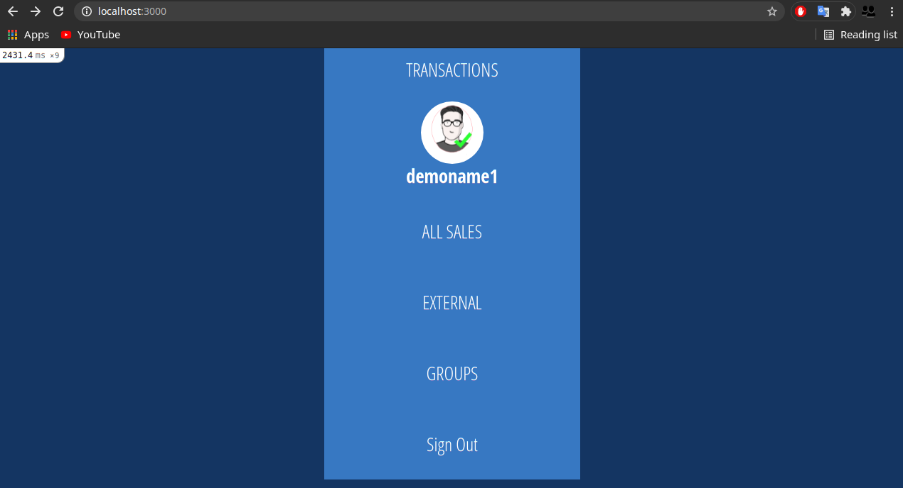
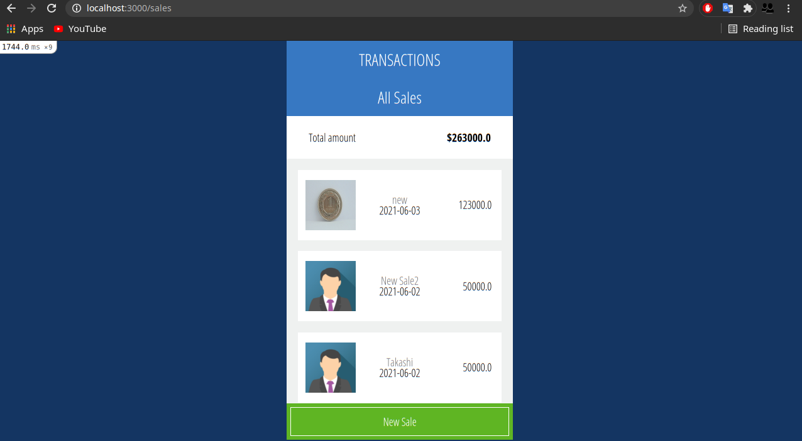
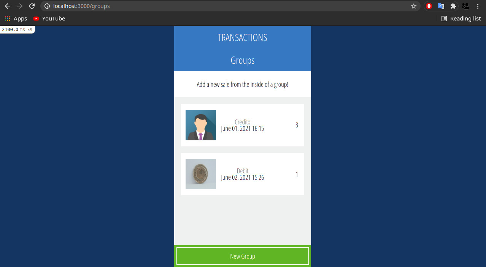

# Sales app with Ruby on Rails

> This repo is a CRM to store and manage sales clients and groups of sales.

## Built With

- Ruby v2.7.0
- Ruby on Rails v6.1.3.2

## Live Demo

[Live Demo](https://salesforjuan.herokuapp.com/)

## Video Demo

[Video Demo](https://www.loom.com/share/9c1aca8a3e3d49f3af7e778ba9c87103)

## Screenshots






## Getting Started

To get a local copy up and running follow these simple example steps.

### Prerequisites

Ruby: 2.7.0
Rails: 6.1
Postgres: >=9.5

### Setup

Install gems with:

```
bundle install
```

Setup database with:

```
   rails db:create
   rails db:migrate
```

### Github Actions

To make sure the linters' checks using Github Actions work properly, you should follow the next steps:

1. On your recently forked repo, enable the GitHub Actions in the Actions tab.
2. Create the `feature/branch` and push.
3. Start working on your milestone as usual.
4. Open a PR from the `feature/branch` when your work is done.


### Usage

Start server with:

```
    rails server
```

Open `http://localhost:3000/` in your browser.

### Run tests

```
    RSpec --format documentation
```

### Deployment

Heroku

## Authors

👤  **Juan Jacobo Hincapie Montes**

- Gmail: [@gmail](jacobo12.montes@gmail.com)
- Github: [@githubhandle](https://github.com/jacobo12montes)
- Twitter: [@twitterhandle](https://twitter.com/HincapieMontes)
- Linkedin: [linkedin](https://www.linkedin.com/in/juan-jacobo-hincapi%C3%A9-montes-93975210b/)
## 🤝 Contributing


Contributions, issues, and feature requests are welcome!

Feel free to check the [issues page](issues/).

## Show your support

Give an ⭐️ if you like this project!

## Acknowledgments

The Creative Commons license of the design

## 📝 License

You can access all the design info (color, typography, layouts) at this link:

[https://www.behance.net/gallery/19759151/Snapscan-iOs-design-and-branding](https://www.behance.net/gallery/19759151/Snapscan-iOs-design-and-branding?tracking_source=)

Design idea by [Gregoire Vella on Behance](https://www.behance.net/gregoirevella)

